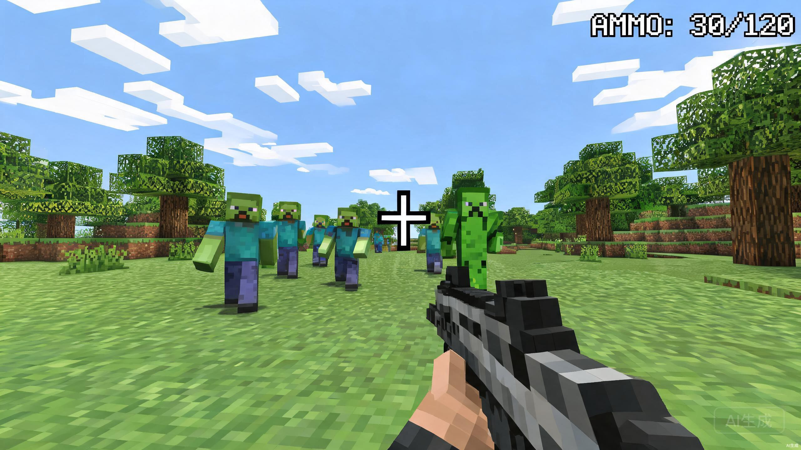
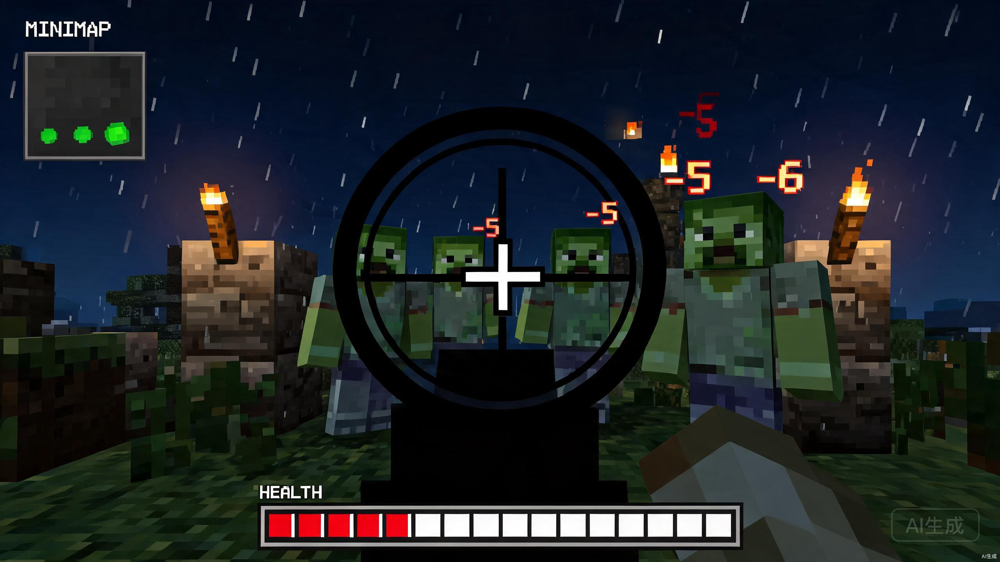

<div align="center">

# 🎮 方块枪战 · Block FPS

**一个单文件、零安装、即开即玩的体素风第一人称射击游戏**
支持 PC 键鼠 + 移动端触屏 · 基于 Three.js

[](https://xyy277.github.io/fps-world/minecraft-fps.html)
[](https://fps-world.pages.dev/minecraft-fps.html)
[](https://github.com/xyy277/fps-world)
[](#-开源协议)
[](minecraft-fps.html)
[](minecraft-fps.html)

**👆 点击上方按钮立即游玩，无需下载，无需安装**

**简体中文** · [English](README.md)

</div>

---

## 🚀 立即游玩

任选一个链接，浏览器打开即可：

| 平台 | 链接 | 特点 |
|------|------|------|
| GitHub Pages | https://xyy277.github.io/fps-world/minecraft-fps.html | 与代码仓库同步，推送即更新 |
| Cloudflare Pages | https://fps-world.pages.dev/minecraft-fps.html | 全球 CDN 加速，访问更快 |

---

## 📸 游戏截图

<div align="center">



*白天体素战场 —— 树木、方块、逼近的敌人*



*夜间战斗 —— 雨幕、火把光、狙击镜、伤害数字*

</div>

---

## 📑 目录

- [✨ 游戏特色](#-游戏特色)
- [🎮 操作方式](#-操作方式)
- [🚀 立即游玩](#-立即游玩)
- [💻 本地运行](#-本地运行)
- [🛠 技术栈](#-技术栈)
- [📂 项目结构](#-项目结构)
- [🤝 参与贡献](#-参与贡献)
- [🗺 路线图](#-路线图)
- [📜 开源协议](#-开源协议)

---

## ✨ 游戏特色

> 我的世界风格 × 第一人称射击 × 波次生存，融在**一个 HTML 文件**里。

### 世界与渲染
- 🌍 **程序化体素世界** —— 64×64×24 地形，含树木、岩石、掩体，开局即随机生成
- 🌗 **昼夜循环** —— 白天视野开阔，夜晚丧尸更狂暴，氛围与难度同步变化
- 🌧 **动态天气** —— 雨/雪粒子系统，与昼夜联动随机切换（晴/雨/雪）
- 🎨 **零资源依赖** —— 所有纹理用 Canvas 程序化生成，所有音效用 Web Audio 合成，无任何图片/音频文件
- ✨ **后处理泛光** —— 高画质下 ACES Filmic 色调映射，电影感画面（可开关）

### 战斗与武器
- 🔫 **五种武器** —— 手枪（初始、精准）/ 步枪（连发）/ 霰弹枪（近战爆发）/ 狙击枪（高倍瞄准镜）/ 火箭筒（范围爆破），鼠标滚轮或按键快速切换
- 💥 **后坐力 + 动态散布** —— 连发增大、停火恢复；换弹动画枪身下沉旋转
- 💣 **手雷 + TNT** —— 手雷抛物线物理投掷（初始 3 颗，击杀掉落补充）；放置 TNT 一枪引爆，连锁爆炸清场
- 🗡 **近战攻击** —— 扇形命中判定 + 冷却，近战利器
- 🎯 **爆头双倍伤害** —— 命中头部金色 hitmarker，伤害翻倍
- ❤️ **掉落补给** —— 击杀敌人掉落红心（回血）与弹药，鼓励主动出击

### 主动技能（P6.4）
- 💨 **冲刺**（E）—— 1.5 秒移速 +50%，8 秒冷却
- 🛡 **护盾**（Z）—— 4 秒减伤 70%，15 秒冷却
- ⏳ **时停**（X）—— 3 秒敌人移速 ×0.2（玩家与粒子不受影响），25 秒冷却

### 敌人与 AI
- 🧟 **波次生存** —— 丧尸与苦力怕轮番进攻，越往后越凶；清空一波回血 25
- 🏹 **4 种敌人** —— 丧尸 / 苦力怕（自爆）/ 蜘蛛（高速 + 跳跃突进）/ 骷髅弓箭手（远程，70% 命中率），按波次解锁
- 🧠 **FSM 敌人 AI** —— 状态机（追击/攻击/逃跑/游荡）+ A* 寻路（10×10 网格，500 迭代上限）
- 🛡 **掩体与预判** —— 敌人利用掩体，预判玩家移动
- 👑 **每 5 波 Boss 战** —— 僵尸王三阶段（100%/60%/30% HP 切换），技能：冲撞 / 召唤 3 只小怪 / AOE；Boss 血量随波次与关卡递增

### 关卡与生物群系（P8）
- 🌍 **4 种 biome** —— 草地 / 沙漠 / 雪原 / 废墟，每种独有地面方块、装饰物（树/仙人掌/枯树/废墟柱）、天空与雾色
- 📈 **关卡递进** —— 每 5 波为一关，关卡切换 biome；敌人 HP ×(1 + 0.25 × (level-1))，速度 +(level-1)×0.15，Boss HP ×(1 + 0.3 × (level-1))
- 🎁 **通关奖励** —— 每 5 波通关弹出 3 选 1 面板（❤️ 战地急救：回满血 + 25 最大生命 / ⚔️ 火力强化 +8% / 💨 风之疾走 +8%），本局永久累积

### 进度与存档（RPG 化）
- 💾 **持久存档** —— localStorage 存最高分/最高波次/总击杀/总局数/总爆头/最佳连杀
- 🏆 **12 项成就** —— 局内实时检测 + Toast 通知 + 成就墙（初次猎杀 → 传奇）
- 📈 **经验与等级** —— 击杀 +10xp、清波 +20xp，升级获技能点
- ⬆ **升级树** —— 4 项属性 × 5 级，全部实际影响玩法：
  - 伤害 +10%/级（子弹与近战）
  - 最大生命 +15/级（替代硬编码 100）
  - 换弹速度 -10%/级
  - 移动速度 +8%/级
- 🏆 **本地排行榜 Top 10** —— localStorage 持久化（id / 得分 / 波次 / 击杀 / 关卡 / 日期），前三名金/银/铜色，本局成绩高亮

### 音频
- 🎵 **程序化 BGM** —— 三段循环旋律（菜单/战斗/结算），Oscillator+GainNode 合成，8-bit chiptune 风格
- 🔊 **完整 SFX** —— 枪声、爆炸、脚步、换弹、击中、UI 点击，全部合成
- 🔇 **默认静音** —— 首次进入无声（避免惊吓），可在设置打开，跨会话记忆

### UI 与反馈
- 🎯 **动态准星** —— 随散布扩大
- 💬 **伤害数字** —— DOM 池 + 3D→2D 投影 + 上浮淡出，爆头金色/暴击红色
- 📋 **击杀提示** —— 最近 5 条，自动淡出
- 🗺 **小地图** —— Canvas 2D，每 3 帧刷新，显示玩家视野/敌人/掉落
- 📊 **计分板** —— 局末表格，武器分布/爆头数/最高连杀
- 🩸 **受击方向指示器** —— 屏幕中央红色三角箭头指向伤害来源，1 秒淡出（P9.2）
- 💥 **弹药警告** —— 弹匣 ≤25% 或手雷耗尽时红色闪烁（P9.2）
- ⚙ **设置面板** —— 画质/音量/灵敏度 + 5 开关（静音/BGM/天气/纹理/后处理），全部记忆

### 操作与平台
- 🖥 **PC 键鼠** —— 完整按键映射 + Pointer Lock + 滚轮切武器
- 📱 **移动端原生触屏** —— 固定方向键 + 疾跑开关 + 滑动视角 + 动作按钮组（开火/跳/放/弹/枪/镜/雷/刀）
- 🎮 **手柄支持** —— 标准 FPS 映射：左摇杆移动 / 右摇杆视角 / RT 射击 / LT 瞄准 / A 跳跃 / X 换弹 / Y 近战 / B 暂停 / RB+LB 切武器 / L3 手雷 / R3 建造 / Start 菜单（P9.5，菜单可开关）
- 🌐 **中英双语 UI（i18n）** —— 菜单切换中/英文，持久化到 save.lang（P9.4）
- 🎮 **首次教程** —— 首次开始游戏显示操作指引（6 秒淡出），PC/触屏双版本

## 🎮 操作方式

### PC 键鼠

| 按键 | 功能 | 按键 | 功能 |
|------|------|------|------|
| W A S D | 移动 | 鼠标 | 视角 |
| 左键 | 射击（击碎方块 / 引爆 TNT） | 右键 | 瞄准射击（ADS，散布减半） |
| Q / 滚轮 | 切换武器（手枪/步枪/霰弹/狙击/火箭筒） | F | 狙击镜（仅狙击枪） |
| C / 中键 | 放置方块 | 1 - 6 | 选择方块（6 = TNT） |
| R | 装填弹药 | G | 手雷 |
| E | 主动技能：冲刺 | Z | 主动技能：护盾 |
| X | 主动技能：时停 | V | 近战 |
| Shift | 疾跑 | 空格 | 跳跃 |
| ESC | 暂停 | | |

### 移动端触屏

| 操作 | 功能 |
|------|------|
| ▲ ◀ ▼ ▶ | 左侧方向键移动（支持多指斜向） |
| 跑 | 点按切换疾跑 |
| 屏幕空白处滑动 | 转动视角 |
| 开火 / 跳 | 射击（按住连发）/ 跳跃 |
| 放 / 弹 / 枪 / 镜 / 雷 / 刀 | 放方块 / 装填 / 切武器 / 狙击镜 / 手雷 / 近战 |
| 底部热键栏 | 点按选择方块（6 = TNT） |
| ⏸ | 左上角暂停 |

> 💡 提示：苦力怕靠近会自爆，优先点杀！TNT 连锁引爆是清场利器。

### 手柄（标准映射，P9.5）

| 输入 | 功能 | 输入 | 功能 |
|------|------|------|------|
| 左摇杆 | 移动（模拟量，死区 0.15） | 右摇杆 | 视角（模拟量，死区 0.12） |
| RT | 射击（按住） | LT | 瞄准（按住） |
| A | 跳跃 | X | 换弹 |
| Y | 近战 | B | 暂停 |
| RB / LB / Back | 切换武器 | L3 | 手雷 |
| R3 | 放置方块 | Start | 菜单 |

> 菜单可开关手柄（持久化到 save.padEnabled）。摇杆支持模拟量平滑移动与视角。

## 💻 本地运行

无需任何构建步骤，三种方式任选其一：

```bash
# 方式一：直接双击文件
直接用浏览器打开 minecraft-fps.html

# 方式二：本地静态服务器（推荐，避免某些浏览器限制）
npx serve .
# 或
python -m http.server 8000
```

## 🛠 技术栈

| 层 | 技术 | 说明 |
|----|------|------|
| 渲染引擎 | [Three.js r128](https://threejs.org/) | 通过 CDN 引入，不打包 |
| 实现语言 | 原生 HTML / CSS / JavaScript | 无框架、无编译、无依赖 |
| 纹理 | Canvas 2D API | 程序化生成像素纹理 |
| 音频 | Web Audio API | 程序化合成 SFX + BGM |
| 存档 | localStorage | 版本化 JSON，持久化进度 |
| 部署 | GitHub Pages + Cloudflare Pages | 静态托管，GitHub Actions 双部署 |

**为什么单文件？** —— 极致的「即开即玩」体验：一个链接发给朋友就能玩，无需安装、无需登录、无需后端。整个游戏（逻辑 + 渲染 + 纹理 + 音效 + 进度）压缩在**一个 HTML 文件**里，约 3500 行代码。

## 📂 项目结构

```
fps-world/
├── minecraft-fps.html   # 游戏本体（单文件，约 3500 行）
├── README.md            # 英文文档（主）
├── README.zh-CN.md      # 本中文文档
├── AGENTS.md            # 多 Agent 协作开发规则
├── docs/                # 研究与进度文档
│   ├── fps-capability-research.md   # 单页 FPS 功能上限调研
│   ├── implementation-progress.md   # 实施进度与路线图
│   └── screenshots/                 # README 展示截图
├── .github/workflows/   # CI：Cloudflare Pages 自动部署
├── .gitignore           # 忽略 .env 等敏感文件
└── .env.example         # 密钥字段占位模板
```

## 🤝 参与贡献

欢迎贡献！无论是修复 bug、优化玩法、改进触屏体验，还是新增武器/敌人类型。

1. Fork 本仓库
2. 创建分支：`git checkout -b feat/your-feature`
3. 提交更改：`git commit -m "feat: 添加 XXX"`
4. 推送分支：`git push origin feat/your-feature`
5. 发起 Pull Request

> 多 Agent / AI 协作开发请先阅读 [AGENTS.md](AGENTS.md)，了解角色分工与编码规范。

## 🗺 路线图

**已完成（P0-P9）**
- [x] P0 —— 架构与性能护栏（画质分级 + 对象池）
- [x] P1 —— 武器手感（后坐力 + 动态散布 + 换弹动画 + 手雷 + 近战）+ 5 把武器（手枪/步枪/霰弹/狙击/火箭筒）
- [x] P2 —— 敌人 AI（FSM 状态机 + A* 寻路 + 掩体预判）+ 4 种敌人（丧尸/苦力怕/蜘蛛/骷髅）
- [x] P3 —— 战斗 UI（伤害数字 + 小地图 + 击杀提示 + 计分板 + 设置）
- [x] P4 —— 存档与进度系统（localStorage + 12 成就 + 升级树）
- [x] P5 —— 沉浸感增强（程序化 BGM + 天气 + 后处理 + 教程 + 5 开关）
- [x] P6 —— 内容扩展（每 5 波 Boss 战 + 主动技能：冲刺/护盾/时停 + ADS 瞄准）
- [x] P7 —— 画质增强（方向光 + 阴影 + 半球光 + biome 雾化 + InstancedMesh 草丛/山体 + 纹理细化）
- [x] P8 —— 多场景关卡（4 biome + 5 波关卡递进 + 难度递增 + 3 选 1 通关奖励）
- [x] P9 —— 体验打磨（本地排行榜 Top 10 + 受击方向指示器 + 弹药警告 + 中英 i18n + 手柄支持）

**规划中（P10）**
- [ ] P10 —— 多人联机 PVE（本地 WebSocket 服务 + Cloudflare Tunnel 穿透 + 主机权威同步 + 4 人房间）

> P9.3 PWA 离线暂缓：Service Worker 需独立 `.js` 文件，违反单文件铁律。
> 详细调研与进度见 [docs/](docs/)。

## 📜 开源协议

MIT License —— 可自由使用、修改、分发。打出你的星星 ⭐ 就是最大的鼓励！

---

<div align="center">

**如果这个游戏让你玩得开心，给个 ⭐ Star 支持一下！**

Made with ❤️ and Three.js

</div>
